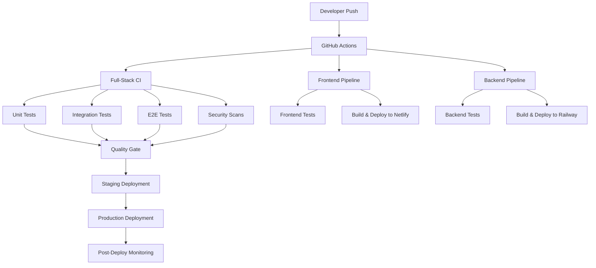

# ChillConnect CI/CD Pipeline Documentation

This document provides comprehensive information about the ChillConnect Continuous Integration and Continuous Deployment (CI/CD) pipeline.

## 📋 Table of Contents

- [Overview](#overview)
- [Pipeline Architecture](#pipeline-architecture)
- [Workflows](#workflows)
- [Testing Strategy](#testing-strategy)
- [Environment Configuration](#environment-configuration)
- [Deployment Process](#deployment-process)
- [Monitoring & Alerts](#monitoring--alerts)
- [Troubleshooting](#troubleshooting)
- [Best Practices](#best-practices)

## 🔍 Overview

The ChillConnect CI/CD pipeline ensures:
- **Quality**: Automated testing at multiple levels
- **Security**: Vulnerability scanning and secret management
- **Performance**: Load testing and optimization
- **Reliability**: Staged deployments with rollback capabilities
- **Compliance**: Age verification and content moderation testing

### Key Features

- ✅ **Multi-environment deployments** (staging, production)
- ✅ **Parallel testing** (frontend, backend, E2E)
- ✅ **Security scanning** (dependencies, secrets, code quality)
- ✅ **Performance monitoring** (Lighthouse CI, load testing)
- ✅ **Automated notifications** (Slack, GitHub status checks)
- ✅ **Mobile app builds** (Android, iOS via Capacitor)

## 🏗 Pipeline Architecture



## 🔄 Workflows

### 1. Full-Stack CI Pipeline (`full-stack-ci.yml`)

**Triggers:**
- Pull requests to `main`
- Pushes to `main`
- Manual dispatch

**Jobs:**
- `frontend-test`: React unit tests, linting, build
- `backend-test`: Node.js unit tests, integration tests
- `e2e-tests`: Playwright end-to-end testing
- `performance-tests`: Lighthouse CI performance audits
- `security-scan`: CodeQL, Trivy vulnerability scanning
- `quality-gate`: Coverage analysis and quality checks

### 2. Frontend Deployment (`frontend-deploy.yml`)

**Triggers:**
- Pushes to `main` (frontend changes)
- Manual dispatch with environment selection

**Process:**
1. **Test & Lint**: ESLint, unit tests with Vitest
2. **Build**: Vite production build with environment variables
3. **Performance**: Lighthouse CI audits
4. **Deploy**: Netlify deployment (staging/production)
5. **Notify**: Slack notifications with deployment URLs

### 3. Backend Deployment (`backend-deploy.yml`)

**Triggers:**
- Pushes to `main` (backend changes)
- Manual dispatch with environment selection

**Process:**
1. **Test & Lint**: Jest tests, ESLint, security scans
2. **Database**: Prisma migrations and seeding
3. **Build**: Docker containerization
4. **Deploy**: Railway deployment with health checks
5. **Load Test**: Artillery.js performance testing
6. **Notify**: Slack notifications with service status

## 🧪 Testing Strategy

### Testing Pyramid

```
       🔺 E2E Tests (Playwright)
      🔺🔺 Integration Tests (Supertest)
     🔺🔺🔺 Unit Tests (Jest/Vitest)
```

### Frontend Testing

**Unit Tests (Vitest + React Testing Library)**
- Component rendering and behavior
- Redux store actions and reducers
- Custom hooks and utilities
- API service functions

**Coverage Requirements:**
- Lines: 80%+
- Functions: 80%+
- Branches: 80%+
- Statements: 80%+

### Backend Testing

**Unit Tests (Jest)**
- Route handlers and middleware
- Service layer functions
- Utility functions
- Database operations

**Integration Tests (Supertest)**
- Full API endpoint flows
- Database interactions
- External service integrations
- Authentication flows

**Coverage Requirements:**
- Lines: 85%+
- Functions: 85%+
- Branches: 85%+
- Statements: 85%+

### End-to-End Testing

**Playwright Tests**
- Complete user journeys
- Cross-browser compatibility
- Mobile responsiveness
- Critical business flows:
  - User registration and verification
  - Booking creation and management
  - Payment processing
  - Chat functionality
  - Admin operations

## ⚙️ Environment Configuration

### Environment Variables

| Environment | Frontend URL | Backend URL | Database |
|-------------|--------------|-------------|----------|
| **Development** | `http://localhost:3000` | `http://localhost:5001` | Local PostgreSQL |
| **Staging** | `https://staging.chillconnect.in` | `https://staging-api.chillconnect.com` | Staging DB |
| **Production** | `https://chillconnect.in` | `https://api.chillconnect.com` | Production DB |

### Required Secrets

See [`.github/SECRETS.md`](.github/SECRETS.md) for complete secrets configuration.

Key secrets include:
- Database connection strings
- JWT signing keys
- Third-party API keys (PayPal, Twilio, Brevo)
- Deployment tokens (Netlify, Railway)
- Monitoring tokens (Sentry, Slack)

## 🚀 Deployment Process

### Staging Deployment

**Automatic Triggers:**
- Every push to `main` branch
- Successful CI pipeline completion

**Process:**
1. Run full test suite
2. Build applications
3. Deploy to staging environments
4. Run smoke tests
5. Update GitHub deployment status

### Production Deployment

**Manual Triggers:**
- GitHub Actions manual dispatch
- Release tag creation

**Process:**
1. Quality gate validation
2. Security approval required
3. Blue-green deployment strategy
4. Health checks and monitoring
5. Rollback capability

### Rollback Procedure

1. **Immediate**: Revert to previous deployment
2. **Database**: Restore from backup if needed
3. **Monitoring**: Verify service restoration
4. **Communication**: Notify stakeholders

## 📊 Monitoring & Alerts

### Health Checks

**Frontend (Netlify)**
- Build status monitoring
- Uptime checks via Netlify
- Performance monitoring via Lighthouse CI

**Backend (Railway)**
- Service health endpoints
- Database connectivity
- External service dependencies

### Alerts Configuration

**Slack Notifications**
- CI/CD pipeline status
- Deployment success/failure
- Security scan results
- Performance degradation

**GitHub Status Checks**
- Required checks for PR merging
- Deployment status updates
- Quality gate results

## 🔧 Troubleshooting

### Common Issues

#### 1. **Build Failures**

**Frontend Build Issues:**
```bash
# Check dependencies
npm ci
npm run lint
npm run test

# Environment variables
echo $VITE_API_BASE_URL
echo $VITE_NODE_ENV
```

**Backend Build Issues:**
```bash
# Database connection
npx prisma migrate status
npx prisma generate

# Dependencies
npm audit
npm run lint
```

#### 2. **Test Failures**

**Unit Test Failures:**
- Check test environment setup
- Verify mock configurations
- Review recent code changes

**E2E Test Failures:**
- Check test data setup
- Verify application deployment
- Review browser compatibility

#### 3. **Deployment Issues**

**Netlify Deployment:**
- Check build logs
- Verify environment variables
- Review redirects configuration

**Railway Deployment:**
- Check service logs
- Verify database migrations
- Review health check endpoints

### Debug Commands

```bash
# Local development
npm run dev
npm run test:watch
npm run lint:fix

# CI debugging
npm run test:ci
npm run build
npm run test:e2e

# Production debugging
curl https://api.chillconnect.com/health
curl https://chillconnect.in
```

## 📝 Best Practices

### Code Quality

1. **Pre-commit Hooks**
   - Automated linting and formatting
   - Unit test execution
   - Conventional commit messages

2. **Code Review Process**
   - Required PR reviews
   - Automated quality checks
   - Security scan reviews

3. **Branch Protection**
   - No direct pushes to `main`
   - Required status checks
   - Up-to-date branch requirement

### Security

1. **Secret Management**
   - Use GitHub Secrets
   - Rotate secrets regularly
   - Principle of least privilege

2. **Dependency Management**
   - Regular security audits
   - Automated vulnerability scanning
   - Dependency updates

3. **Code Scanning**
   - Static analysis with CodeQL
   - Container vulnerability scanning
   - License compliance checking

### Performance

1. **Build Optimization**
   - Parallel job execution
   - Caching strategies
   - Incremental builds

2. **Test Optimization**
   - Parallel test execution
   - Smart test selection
   - Mock external dependencies

3. **Deployment Optimization**
   - Blue-green deployments
   - Health check automation
   - Rollback automation

### Compliance

1. **Age Verification Testing**
   - Automated verification flow tests
   - Document upload validation
   - Access control verification

2. **Content Moderation**
   - Automated content scanning
   - Compliance checks
   - Audit trail maintenance

3. **Data Protection**
   - Privacy compliance testing
   - Data encryption verification
   - Access logging

## 📞 Support

### Getting Help

- **CI/CD Issues**: Create issue in GitHub repository
- **Deployment Problems**: Check GitHub Actions logs
- **Security Concerns**: Contact security team immediately

### Useful Links

- [GitHub Actions Documentation](https://docs.github.com/en/actions)
- [Netlify Deployment Docs](https://docs.netlify.com/)
- [Railway Deployment Docs](https://docs.railway.app/)
- [Playwright Testing Docs](https://playwright.dev/)

---

*Last Updated: January 2025*
*Version: 1.0.0*